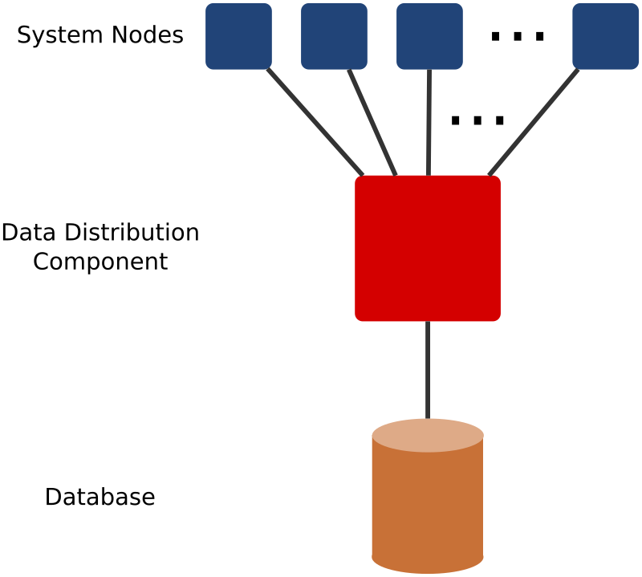

# Experiment Outline

The experiment used a simulation of a centralized component inside a distributed system that handles
decision-making about distribution of data among the system nodes. This is illustrated in the figure
below.

In a real distributed system, there are usually multiple components responsible for data distribution,
which cooperate on this task. They are possibly organized in some hierarchy and/or may not be even designed
in a centralized but distributed manner. In our simulation, we abstract from these implementation details as
we aim to focus on behavior of data-distribution algorithms, not on behavior of their particular
implementations into a particular distributed system.

There are no negative effects of this abstraction on the quality of the results from the view-point of the
stated experiment's goals. This is visible from the following arguments:
1. Any of the configurations of data distributing components can be represented by a single, centralized
   component.
2. Metrics are not collected with respect to a real time but to an iteration number. The simulation is
   composed of subsequent iterations. At the end of each iteration, the system and the data are in a
   consistent state. Every reasonable existing distributed system has such iterations. Even in an eventual
   consistency model, there are points of complete data consistency.

These arguments follow our idea that we investigated behavior of the data-distribution algorithms, not
their particular implementations in concrete systems.

Furthermore, this abstraction significantly simplifies the implementation. We did not have to
solve distributed communication, data consistency, performance, etc. This decreases the amount
of required code which indirectly increases credibility of the gained results.
