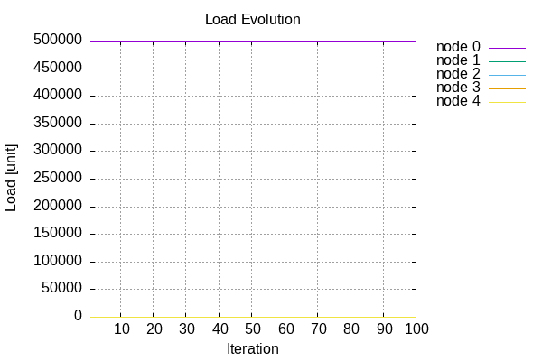
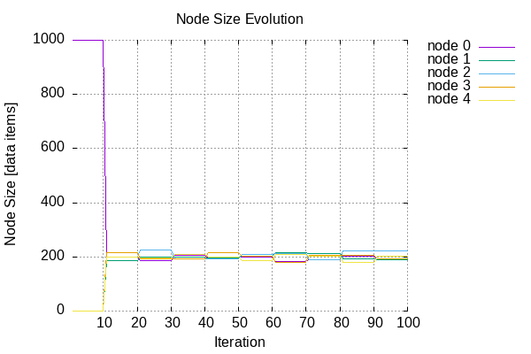
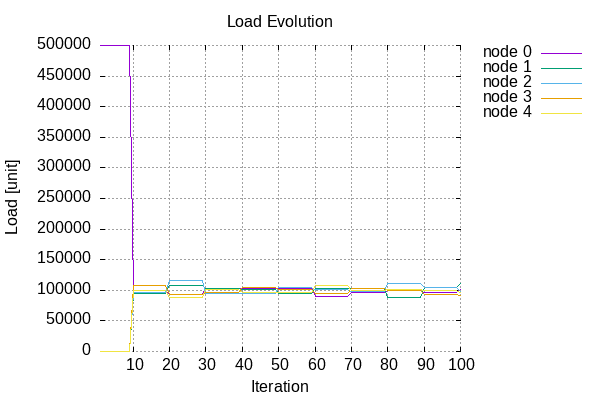
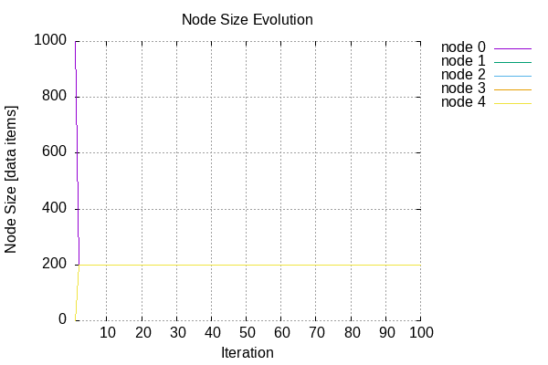
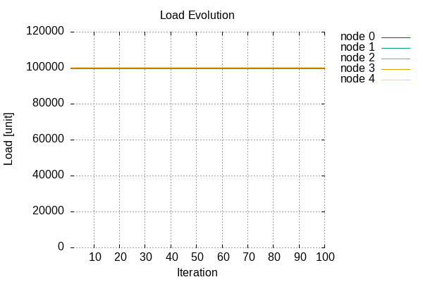
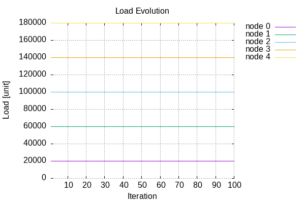

# Results

## OneNode-Lru
| Node Size | Load | Data Item Churn |
| --------- | ---- | --------------- |
|  |  |  |

## Random-Lru
| Node Size | Load | Data Item Churn |
| --------- | ---- | --------------- |
|  |  |  |

## RoundRobin-Lru
| Node Size | Load | Data Item Churn |
| --------- | ---- | --------------- |
|  |  |  |

## Uniform-Lru
| Node Size | Load | Data Item Churn |
| --------- | ---- | --------------- |
|  |  |  |
