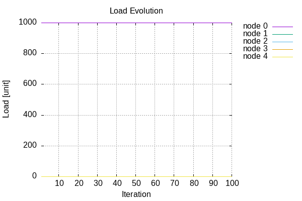

# Results

Below, you can see results for pairs of a workload and a data balancing algorithm, always code-named as "workload-algorithm". They are ordered first by the workload name and second by the algorithm name.

## FavoriteItems5-OneNode
| Node Size | Load | Data Item Churn |
| --------- | ---- | --------------- |
|  |  |  |

## FavoriteItems5-Random
| Node Size | Load | Data Item Churn |
| --------- | ---- | --------------- |
|  |  |  |

## FavoriteItems5-RoundRobin
| Node Size | Load | Data Item Churn |
| --------- | ---- | --------------- |
|  |  |  |

## FavoriteItems5-Uniform
| Node Size | Load | Data Item Churn |
| --------- | ---- | --------------- |
|  |  |  |

## FavoriteItems7-RoundRobin
| Node Size | Load | Data Item Churn |
| --------- | ---- | --------------- |
|  |  |  |

## Lru-OneNode
| Node Size | Load | Data Item Churn |
| --------- | ---- | --------------- |
|  |  |  |

## Lru-Random
| Node Size | Load | Data Item Churn |
| --------- | ---- | --------------- |
|  |  |  |

## Lru-RoundRobin
| Node Size | Load | Data Item Churn |
| --------- | ---- | --------------- |
|  |  |  |

## Lru-Uniform
| Node Size | Load | Data Item Churn |
| --------- | ---- | --------------- |
|  |  |  |

## UniformDist-OneNode
| Node Size | Load | Data Item Churn |
| --------- | ---- | --------------- |
|  |  |  |

## UniformDist-Random
| Node Size | Load | Data Item Churn |
| --------- | ---- | --------------- |
|  |  |  |

## UniformDist-RoundRobin
| Node Size | Load | Data Item Churn |
| --------- | ---- | --------------- |
|  |  |  |

## UniformDist-Uniform
| Node Size | Load | Data Item Churn |
| --------- | ---- | --------------- |
|  |  |  |

## Uniform-OneNode
| Node Size | Load | Data Item Churn |
| --------- | ---- | --------------- |
|  |  |  |

## Uniform-Random
| Node Size | Load | Data Item Churn |
| --------- | ---- | --------------- |
|  |  |  |

## Uniform-RoundRobin
| Node Size | Load | Data Item Churn |
| --------- | ---- | --------------- |
|  |  |  |

## Uniform-Uniform
| Node Size | Load | Data Item Churn |
| --------- | ---- | --------------- |
|  |  |  |
